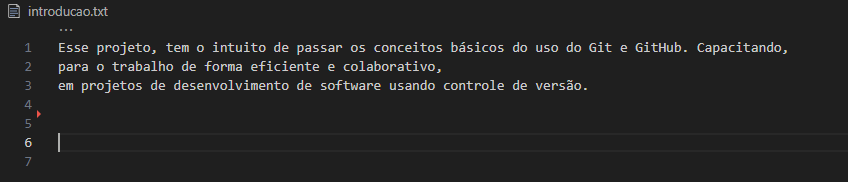

# Exercicio 1: 
#### R: Alterando o nome do usuário global no git.

#### R: Alterando o nome do e-mail global no git.

# Exercicio 2:
#### R: Inicializando o git no repositorio MyProject.

#### R: Criando um arquivo introducao.txt.
##### obs: No arquivo intoducao.txt tem uma breve introdução sobre o projeto.

# Exercicio 3:
#### R: Criando uma branch chamado "feature-navbar".

#### R: Adicionando mais informações no arquivo introducao.txt.

#### R: git status para verificar as alterações dos arquivos.

#### R: git add . para adicionar as alterações dos arquivos.

#### R: git commit para criar um ponto de registro de todas as alterações.

#### R: git checkout master para voltar para a branch master, após a troca de branch verifiquei o arquivo introdução e as alterações feitas não estava lá.
#### obs: para não encher de imagens não fiz o print, pois estava igual a imagem do exercicio 2.

#### R: git merge feature-navbar para juntar as alterações realizadas na branch feature-navbar com a master.
#### obs: para não encher de imagens não fiz o print dessa também, pois estava igual a imagem do exercicio 3.

